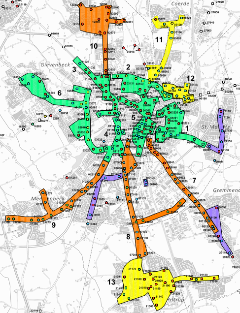

# {data-background="img/codeforms.jpg"}


# "I'm here<br>for the drinks.<br>What *is* Shiny, though?"

***
*"Shiny is an R package that makes it easy to<br>**build interactive web apps straight from R**<br>...<br>Shiny combines the computational **power of R**<br>with the **interactivity** of the modern web."*<br><br>- shiny.rstudio.com

## Shiny<br>= R<br>+ visualization<br>+ interaction {data-background="img/manhattan.jpg"}


# why we love Shiny<br><br><small>and why you should, too</small>

## R centered

- Get started with 20 lines of code
- Best web tool for R coders
- Well integrated with RStudio

## Quickly developed

- First app in 15 minutes
- Rapid prototyping
- No HTML, Javascript, PHP, Flash, ...

## Shiny

- Good looks by default
- Styleable with CSS
- Extendable (e.g. d3)


# how Shiny works

## Typical Workflow

1. Model & visualize, e.g. ```ggplot2```
2. Include in Shiny, including interactiveness
3. App done!

## Parts of shiny app

```
library(shiny)

...  # LOAD DATA
  
ui <- ...  # FRONTEND

server <- ...  # BACKEND

shinyApp(ui = ui, server = server)  # START APP
```

## Demo!

```https://github.com/ThorbenJensen/garage-shiny ```

## Part 1/4: load data

```
df_processed <-
  df %>%
  mutate(., free = as.numeric(free)) %>%
  mutate(., datetime = as_datetime(df$datetime,
                                   tz = "Europe/Berlin")) %>%
  mutate(., time = hms::as.hms(datetime))
```

## Part 2/4: frontend

```
ui <- fluidPage(

  titlePanel("Need a parking spot ?"),

  sidebarLayout(
    sidebarPanel(
      selectInput(inputId = "garage_name",
                  label = "Choose a car park:",
                  choices = unique(df_processed$name),
                  selected = "Parkhaus Karstadt")
    ),
    mainPanel(
      plotOutput(outputId = "time_series_plot")
    )
  ),
  theme = "custom.css"
)
```

## Part 3/4: CSS

```
@import url('https://fonts.googleapis.com/css?family=Satisfy');

.h2, h2 {
  font-size: 60px;
  font-family: 'Satisfy', courier;
  color: #f14559;
}

body {
  font-size: 20px;
}

.well {
  background-color: #f13a5994;
}
```


## Part 4/4: backend
```
server <- function(input, output) {

  output$time_series_plot <- renderPlot({

    df_processed %>%
      filter(., name == input$garage_name) %>% 
      ggplot(data = ., aes(x = time, y = free)) +
      geom_line(aes(group = date), alpha = .3) +
      theme_bw() +
      xlab("Time of day") +
      ylab("Free spots") +
      ggtitle(paste0("Free parking spots per day for car park '",
                     input$garage_name, "'")) +
      theme(text = element_text(size = 20))
  })
}
```

## Containerize it!

why? makes shiny easily deployable!

1. Write Dockerfile
```
FROM rocker/shiny
RUN install2.r --error dplyr lubridate ggplot2 hms
COPY ./app /srv/shiny-server/
```

2. Build and run container
```
docker build -t garage-shiny .
docker run --rm -p 3838:3838 garage-shiny
```

# our project<br><br>Traffic Dynamics

## Why Traffic Data?<br>Climate Change!

<!---
 - climate change is a global challenge
 - we might stop it on the local level
-->


## Emissions

<!---
 - in Germany: traffic is responsible for roughly 18% of greenhouse gases
 - the second biggest sector of greenhouse gases; the only sector that *grows*
-->


## Kilometers


- *cars*: at several traffic lights, more than 700 count locations
- *bicycles*: 8 count locations

## Open Data
- hourly traffic counts & weather conditions
- data source: Stadt Münster, open data license



## Demo!

`https://traffics.codeformuenster.org`


# Showdown:<br><br>Bayesian regression<br>models in Shiny

## Example question to the data

- Does the weather affect the number of cyclists? How?

```
library(brms)

bike_model <- brm(count ~ temperature + windspeed + rain + month,
                  family = negbinomial,
                  data = bikes_neutor)
```

## How to include in Shiny

- `ui`

```
...
plotlyOutput("plotTemperature"),
...
```

- `server`

```
  output$plotTemperature <- renderPlotly({
    p <- plot(marginal_effects(bike_model,
                       effects = "temperature",
                       plot = FALSE)
              )[[1]] + 
         xlab("Temperatur (in °C)") +
         ylab("Anzahl Fahrräder") +
         theme_minimal()
    
    ggplotly(p)
  })
  
```

## Demo!

```https://traffics.codeformuenster.org```


# your turn:<br><br>what else to analyze?

## Our questions to you

- What would you like to know about traffic data?
- Any ideas for analyses/models?
- Do you know stakeholders to involve?


# our turn:<br><br>more questions?

## contact us
- t.kluth @ posteo.de
- jensen.thorben @ gmail.com

## Thanks to
- Tobias Bradtke, Code for Münster
- Ralf Renkhoff, Stadt Münster
- IG Fahrradstadt

## Thank you!

## Sources
- climate change graphics: https://perspective-daily.de/article/391/SjcGXmvB
- emissions & kilometers graphics: https://www.umweltbundesamt.de/daten/verkehr/umweltbelastungen-durch-verkehr
- bike counter map: https://www.stadt-muenster.de/verkehrsplanung/verkehr-in-zahlen/radverkehrszaehlungen.html
